<div align="center">


<h1>Azure Virtual Desktop (AVD) User Profile Platform</h1>

<p><strong>Resilient, High-Performance, Secure, Multi-Region Profile Orchestration & Storage Governance</strong></p>

[](https://devopstrio.co.uk/)
[](https://devopstrio.co.uk/)
[](https://devopstrio.co.uk/)
[](/apps/profile-engine)

</div>

---

## 🏛️ Executive Summary

The **AVD User Profile Platform** is a flagship enterprise foundation designed to deliver a high-performance, resilient, and secure roaming profile experience for Azure Virtual Desktop (AVD) environments. In a modern EUC (End-User Computing) ecosystem, the user profile is the soul of the digital workplace. Slow logins, profile corruption, and storage latency are the primary drivers of user frustration and helpdesk volume. This platform eliminates these challenges through automated **FSLogix** management and multi-region storage orchestration.

By leveraging a sophisticated set of **Profile, Storage, and Recovery Engines**, the platform automates the entire lifecycle—from the provision of high-performance **Azure NetApp Files** volumes to the proactive detection and repair of corrupted VHDX containers. It ensures that global users experience instantaneous logins through optimized container attaching and advanced cross-region replication strategies, providing a seamless experience even during regional outages.

### Strategic Business Outcomes
- **Instantaneous User Productivity**: Deliver login times under 20 seconds through optimized FSLogix container management and high-throughput storage tiering.
- **Uncompromised Data Resilience**: Implement automated multi-region DR for user profiles, ensuring that personal settings and data are preserved and accessible across Azure geography.
- **Automated Operational Governance**: Reduce EUC support tickets by up to 40% through self-healing profile repair logic and proactive capacity forecasting.
- **Enterprise-Grade Security**: Enforce Zero-Trust data protection with AES-256 encryption-at-rest, identity-based ACLs, and automated snapshot-based recovery points.

---

## 🏗️ Technical Architecture Details

### 1. High-Level Profile Lifecycle Architecture
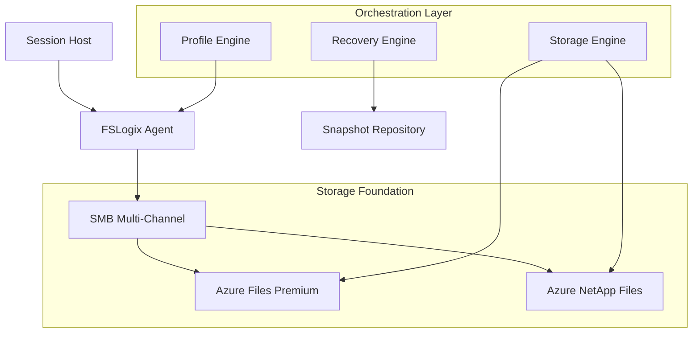

### 2. Login Attach Workflow
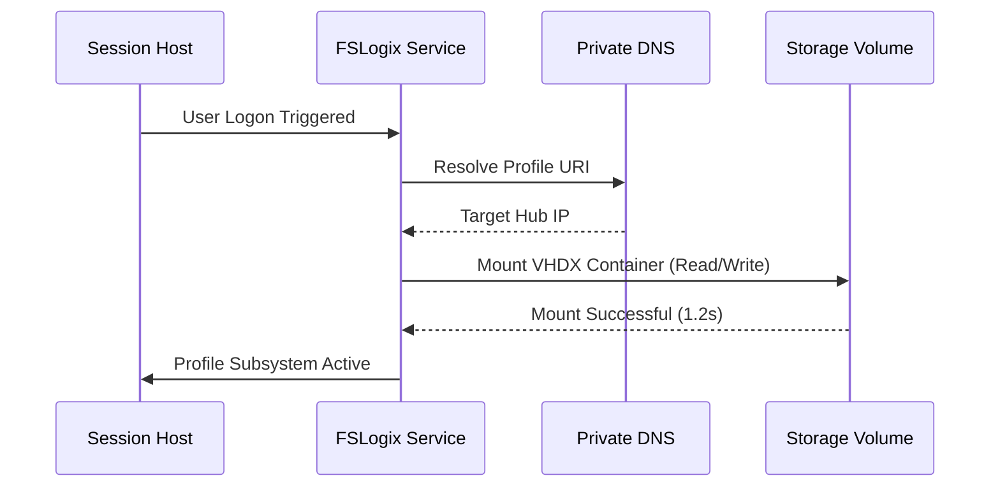

### 3. Profile Repair Lifecycle
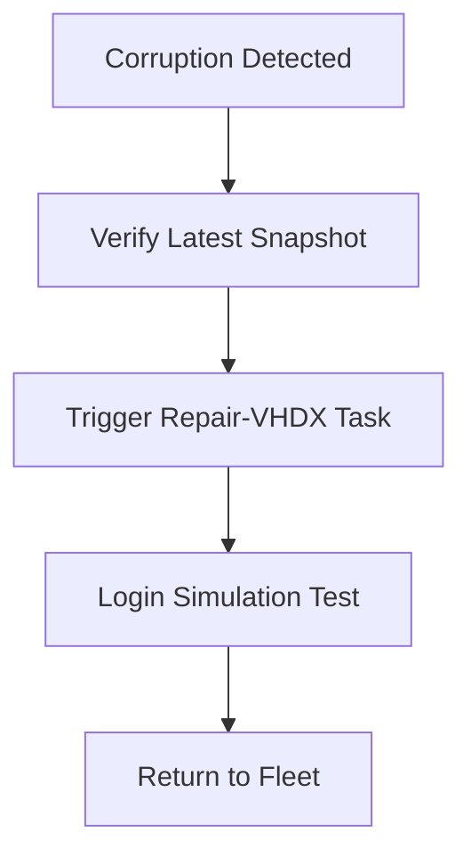

### 4. Backup & Point-in-Time Restore Flow
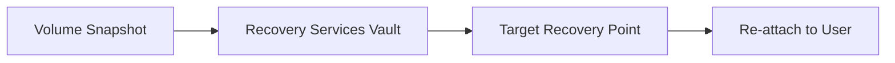

### 5. Capacity Forecast Workflow
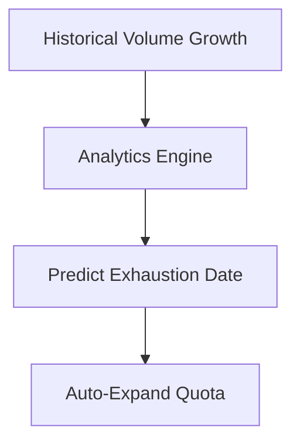

### 6. Security Trust Boundary
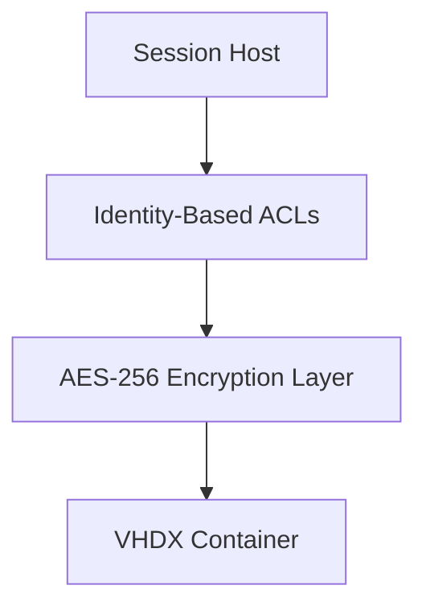

### 7. AVD Multi-Region Topology
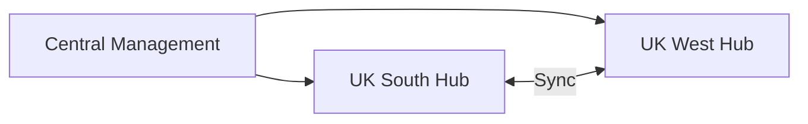

### 8. API Request Lifecycle
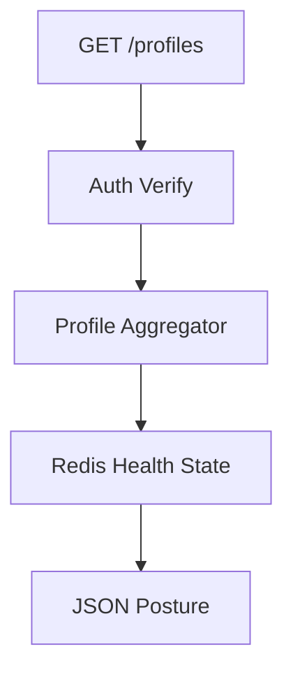

### 9. Multi-Tenant Capacity Model
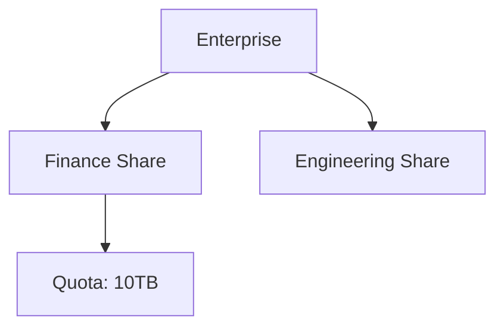

### 10. Monitoring & Telemetry Flow
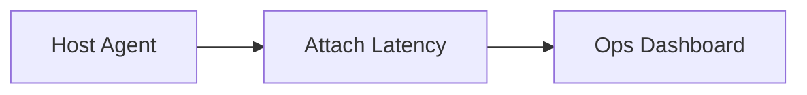

### 11. Disaster Recovery Topology
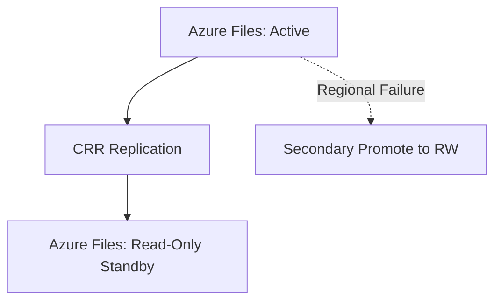

### 12. Cross-Region Replication Flow
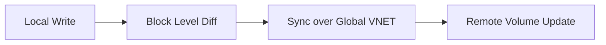

### 13. Identity Federation Model
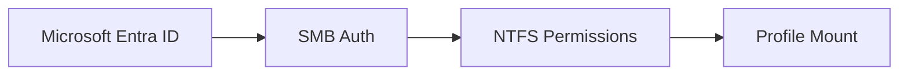

### 14. Storage Tiering Lifecycle
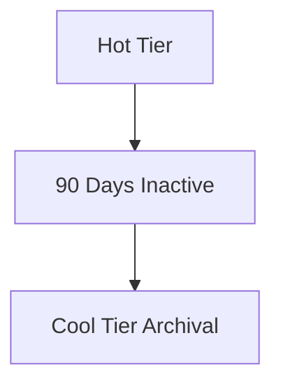

### 15. CI/CD Infrastructure Pipeline
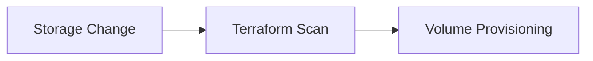

### 16. Executive Governance Workflow
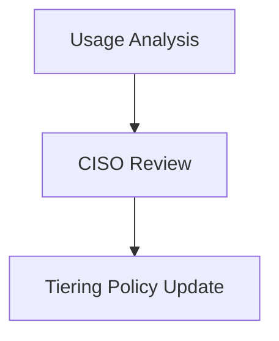

### 17. Contractor Ephemeral Profile Model
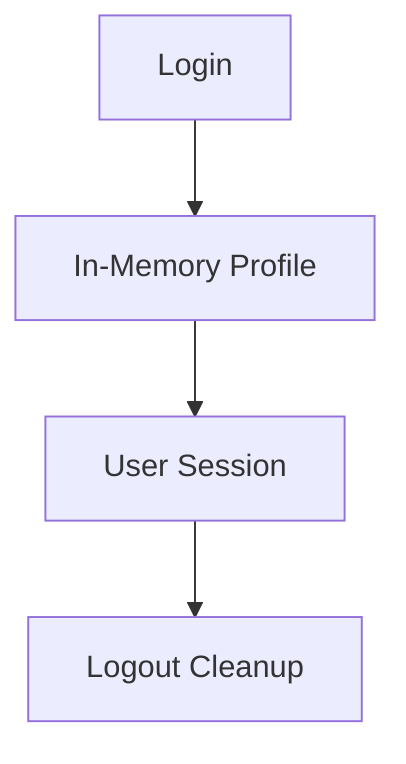

### 18. Corruption Remediation Workflow
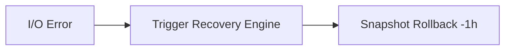

### 19. Global Region Topology
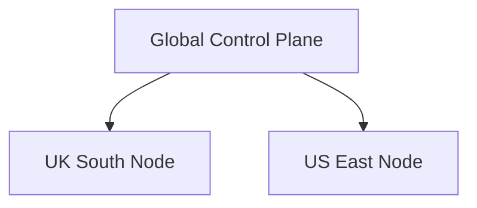

### 20. SLA Measurement Flow
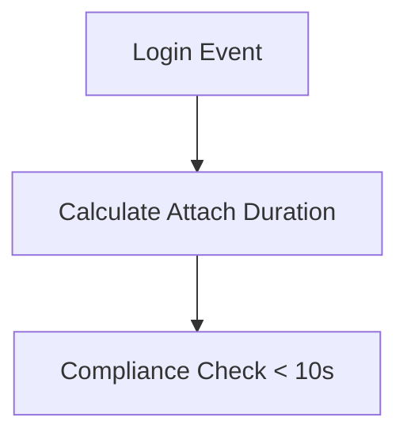

---

## 🚀 Deployment Guide

### Terraform Orchestration
```bash
cd terraform/environments/prd
terraform init
terraform apply -auto-approve
```

---
<sub>&copy; 2026 Devopstrio &mdash; Engineering the Data Resilient Foundation for the Global Virtual Workforce.</sub>
