<div align="center">


<h1>AVD User Profile Platform</h1>

<p><strong>The Institutional-Grade Platform for Standardized Profile Foundations, FSLogix Governance, and Multi-Cloud EUC Ecosystems.</strong></p>

[]()
[]()
[]()

<br/>

> **"Industrializing user profiles to automate digital workplace foundations."** 
> **AVD User Profile Platform** is an enterprise-grade platform designed to provide a secure, measurable, and highly automated foundation for global virtual desktop operations. It orchestrates the complex lifecycle of user personas—from automated FSLogix container provisioning and multi-region storage reconciliation to high-throughput profile intelligence and unified EUC auditing.

</div>

---

## 🏛️ Executive Summary

Fragmented profile storage and manual FSLogix orchestration are strategic operational liabilities; lack of a standardized profile framework is a primary barrier to organizational engineering maturity. Organizations fail to scale their virtual desktops not because of a lack of compute, but because of fragmented evaluation standards, lack of automated profile reconciliation, and an inability to orchestrate persona planes with operational precision.

This platform provides the **Profile Intelligence Plane**. It implements a complete **AVD-User-Profile-as-Code Framework**, enabling CTOs and EUC Architects to manage global user foundations as first-class citizens. By automating the identification of profile regressions through real-time telemetry analysis and orchestrating the provisioning of secure performance-driven storage policies, we ensure that every organizational persona—from core office workers to edge engineering contractors—is provisioned by default, audited for history, and strictly aligned with institutional EUC frameworks.

---

## 📐 Architecture Storytelling: Principal Reference Models

### 1. Principal Architecture: Global Profile Lifecycle & Intelligence Plane
This diagram illustrates the high-level relationship between the Session Host, the FSLogix Agent, and the underlying Storage Foundation (Azure Files, ANF). It defines the bridge between virtual sessions and the user persona substrate.

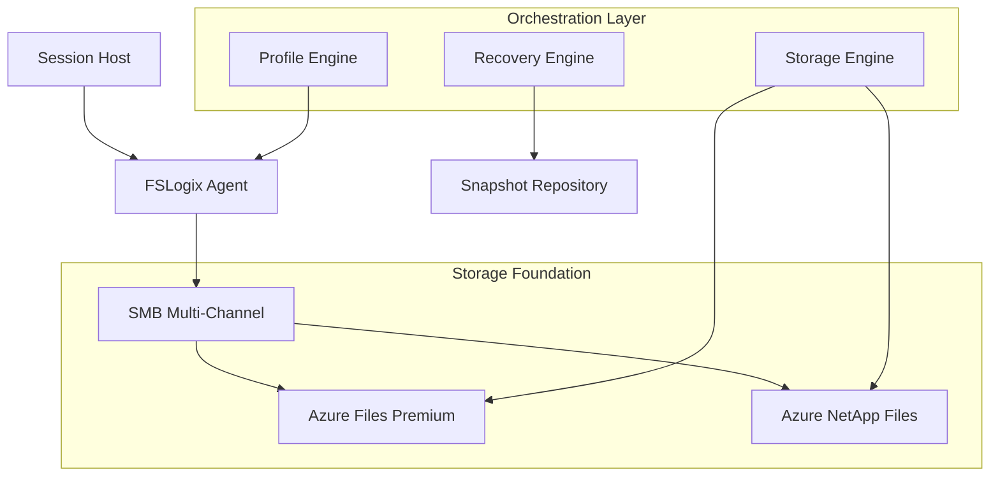

### 2. The Profile Lifecycle Flow (Attach & Tiering)
The continuous path of a user persona from initial login trigger and VHDX mount to automated storage tiering and ephemeral cleanup. This ensures zero-interruption operations through dependency-aware login flows.

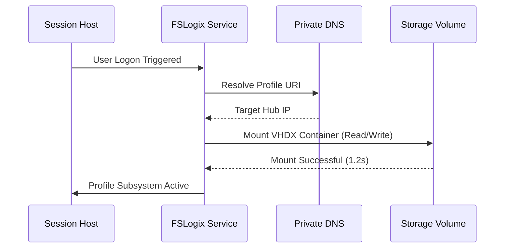

**Contractor Ephemeral Profile Model:**
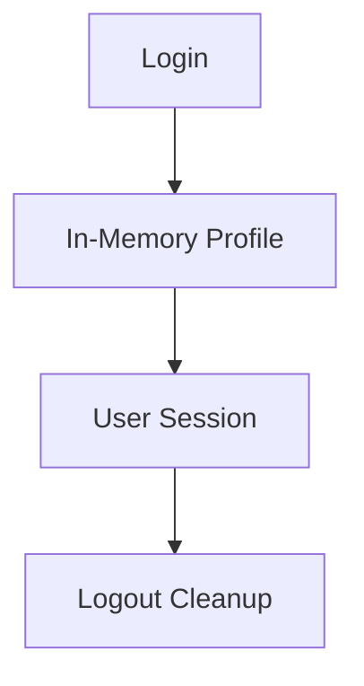

**Storage Tiering Lifecycle:**
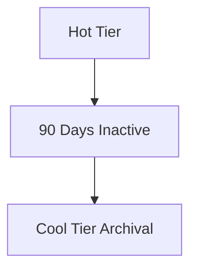

### 3. Distributed Profile Topology (Global Regions & Sync)
Strategically orchestrating standardized profiles across global regions (UK South, US East) and multi-tenant shares, providing a unified institutional view of persona readiness.

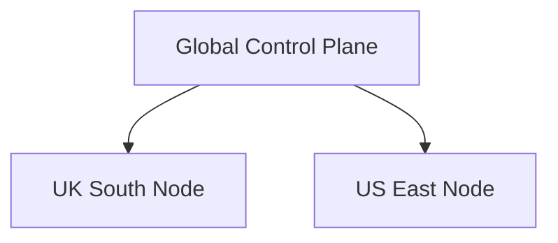

**Cross-Region Replication Flow:**
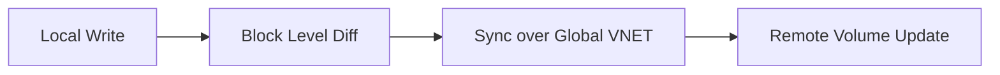

### 4. Governance Hub & Control Plane Flow
Executing complex logic for securing the bridge between user requests and storage volumes, ensuring every attach is authorized, capacity is forecasted, and executive oversight is maintained.

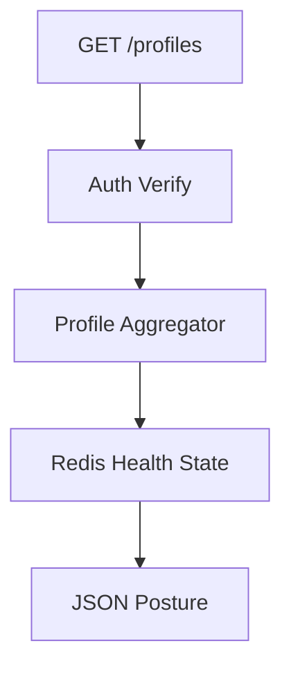

**Capacity Forecast Workflow:**
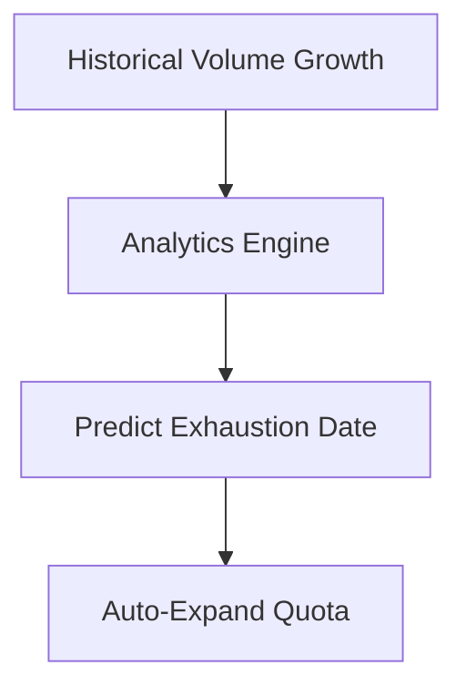

**Executive Governance Workflow:**
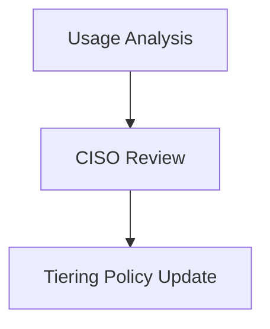

### 5. Multi-Cloud Profile Federation & Global Topology
Automatically managing unified profile standards across global hub-spoke architectures and diverse cloud regions, ensuring institutional data residency and privacy boundaries by default.

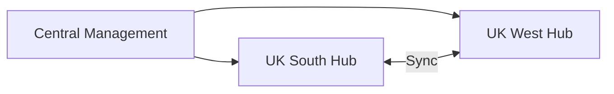

### 6. Encryption & Perimeter Protection Flow (Security Trust Boundary)
Managing the lifecycle of a profile request, automatically enforcing institutional AES-256 encryption and identity-based ACLs as required by security policy, ensuring zero-latency security confidence.

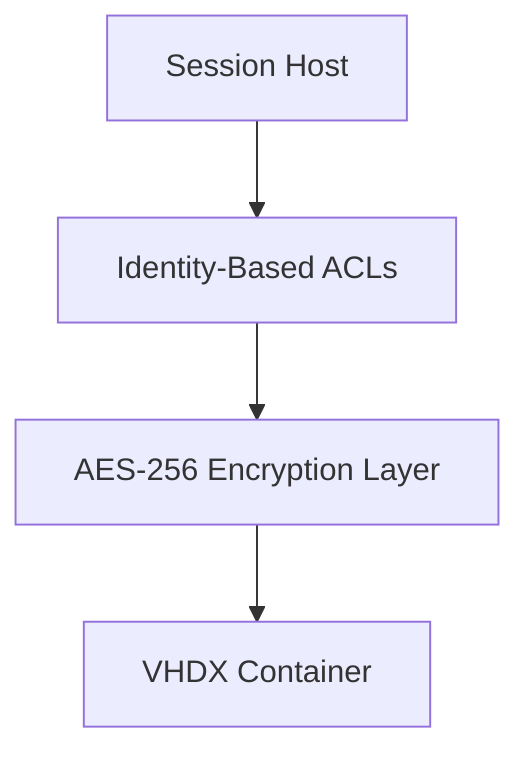

### 7. Institutional Profile Maturity Scorecard (SLA Measurement)
Grading organizational performance based on key indicators: Attach Latency (Login Speed), Profile Health Index, and SLA Compliance Scores.

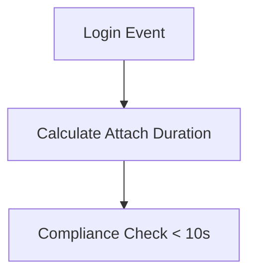

### 8. Identity & RBAC for Profile Governance
Managing fine-grained access to profile shares, provisioning workers, and audit logs between Global Holding Companies and Business Unit shares.

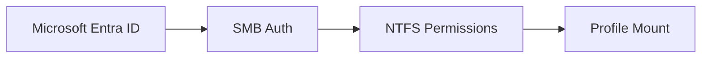

**Multi-Tenant Capacity Model:**
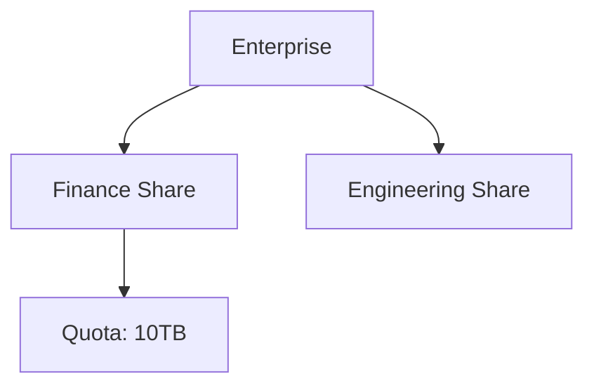

### 9. IaC Deployment: AVD-User-Profile-as-Code Framework
Using modular CI/CD pipelines to deploy and manage the versioned distribution of the profile landing zones, storage tiers, and validation fleets.

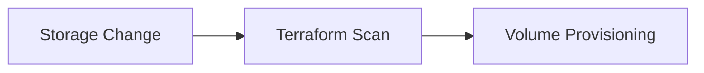

### 10. AIOps Profile Drift & Risk Validation Flow
Using advanced analytics to identify sudden surges in attach latency, unauthorized profile changes, or unusual delivery pattern changes that could result in institutional risk or downtime.

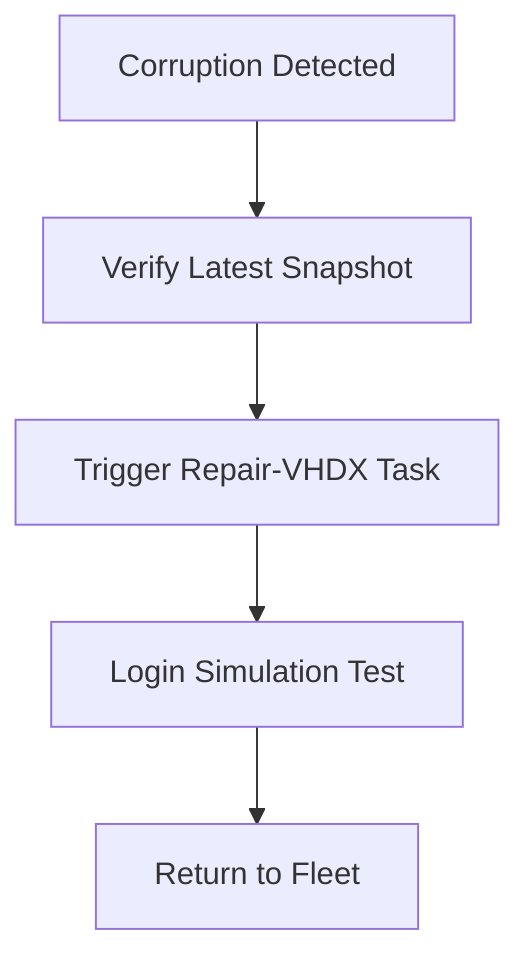

**Corruption Remediation Workflow:**
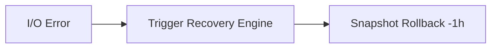

**Disaster Recovery Topology:**
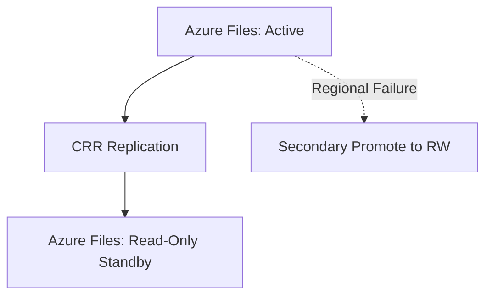

### 11. Metadata Lake for Forensic Profile Audit
Storing long-term records of every profile integration event (metadata), every snapshot executed, and every live stream telemetry for institutional record-keeping and forensic analysis.

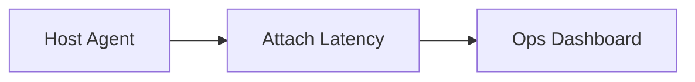

**Backup & Restore Flow:**
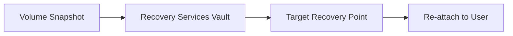

---

## 🏛️ Core Governance Pillars

1.  **Unified Foundation Coordination**: Maximizing resilience by centralizing all profile measurement through a single institutional plane.
2.  **Automated Profile Provisioning**: Eliminating "manual tracking" scenarios through proactive orchestration and pattern verification.
3.  **Sequential Profile Intelligence**: Ensuring zero-interruption operations through dependency-aware login-driven data engineering.
4.  **Zero-Trust Identity Protection**: Automatically enforcing identity-based access, SMB encryption, and policy evaluation across all assurance tiers.
5.  **Autonomous Operations Logic**: Guaranteeing reliability through automated industry-specific effectiveness monitoring runbooks.
6.  **Full Profile Auditability**: Immutable recording of every profile change and profile provision for institutional forensics.

---

## 🛠️ Technical Stack & Implementation

### Profile Engine & APIs
*   **Framework**: Python 3.11+ / FastAPI.
*   **Performance Engine**: Custom Python-based logic for multi-cloud storage reconciliation and DORA-style EUC metrics.
*   **Integrations**: Native connectors for Azure Files, Azure NetApp Files, and FSLogix Agent.
*   **Persistence**: PostgreSQL (Profile Ledger) and Redis (Live Attach State).
*   **Auth Orchestrator**: Federated OIDC/SAML for least-privilege profile management access.

### Governance Dashboard (UI)
*   **Framework**: React 18 / Vite.
*   **Theme**: Dark, Slate, Indigo (Modern high-fidelity productivity aesthetic).
*   **Visualization**: D3.js for delivery topologies and Recharts for ROI velocity analytics.

### Infrastructure & DevOps
*   **Runtime**: AWS EKS or Azure Kubernetes Service (AKS) for management plane.
*   **Measurement Hub**: Managed event sourcing for immutable productivity timeline reconstruction.
*   **IaC**: Modular Terraform for deploying the profile landing zone and validation fleet.

---

## 🏗️ IaC Mapping (Module Structure)

| Module | Purpose | Real Services |
| :--- | :--- | :--- |
| **`infrastructure/profile_hub`** | Central management plane | EKS, PostgreSQL, Redis |
| **`infrastructure/enforcers`** | Distributed profile provisioners | Azure, AWS, GCP APIs |
| **`infrastructure/storage_pipes`** | Data Ingestion Hubs | Webhooks, Lambda |
| **`infrastructure/auditing`** | Forensic modernization sinks | S3, Athena, Quicksight |

---

## 🚀 Deployment Guide

### Local Principal Environment
```bash
# Clone the AVD User Profile repository
git clone https://github.com/devopstrio/avd-user-profile.git
cd avd-user-profile

# Configure environment
cp .env.example .env

# Launch the Profile stack
make init

# Trigger a mock profile update and automated guardrail validation simulation
make simulate-profile
```

Access the Management Portal at `http://localhost:3000`.

---

## 📜 License
Distributed under the MIT License. See `LICENSE` for more information.

---
<div align="center">
  <p>© 2026 Devopstrio. All rights reserved.</p>
</div>
